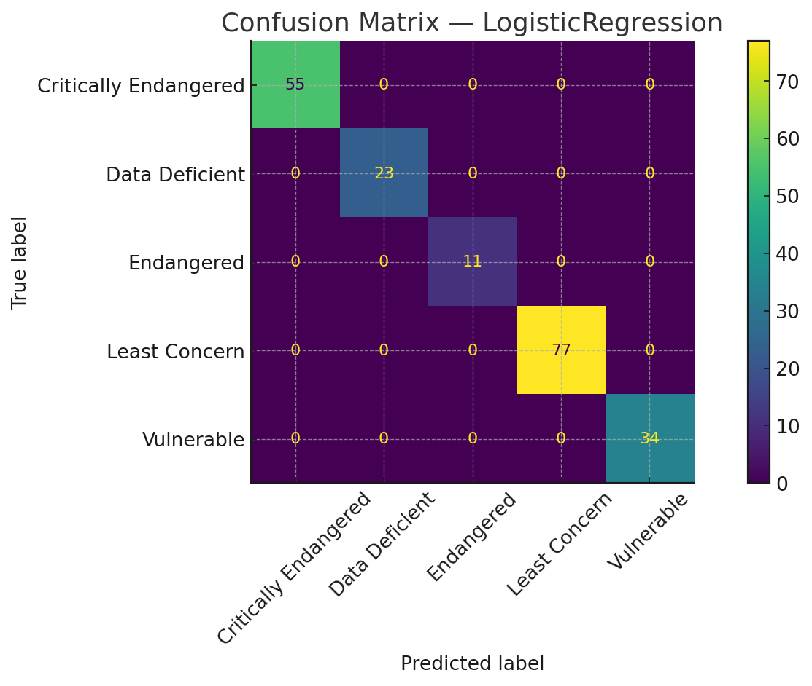
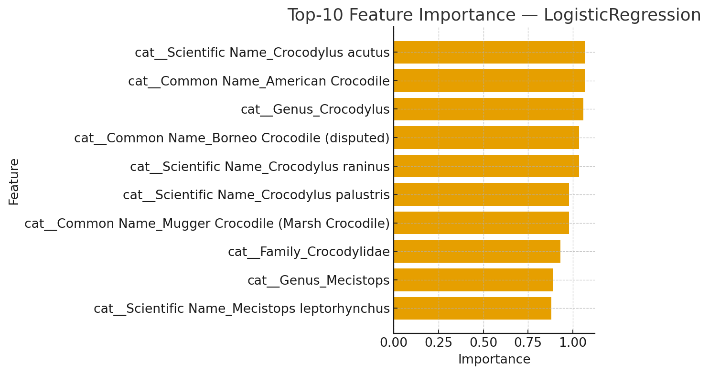

# Assignment 1 — Predicting Crocodile Conservation Status (CRISP‑DM)

This repo contains all artifacts for **Assignment 1**: a complete CRISP‑DM pipeline using `pandas`, `scikit‑learn`, and `matplotlib` to predict **Conservation Status** from `crocodile_dataset.csv`.

## Structure
```
Assignment_1/
├── README.md
├── requirements.txt
├── TEST_METRICS.csv
├── metrics.json
├── classification_report.txt
├── data/
│   └── crocodile_dataset.csv
├── figures/
│   ├── confusion_matrix_best_model.png
│   └── top10_feature_importance.png
└── src/
    └── train_eval.py
```

## How to Run (Local)
```bash
python -m venv .venv && source .venv/bin/activate   # Windows: .venv\Scripts\activate
pip install -r requirements.txt
python src/train_eval.py
```

This will print test metrics and (re)generate the figures under `figures/` and files under the repo root.

## Results (Filled)
| Model              |   Accuracy |   F1_macro |
|:-------------------|-----------:|-----------:|
| LogisticRegression |          1 |          1 |
| RandomForest       |          1 |          1 |

- **Best model** (by F1_macro): **LogisticRegression**
- **Weakest class by F1**: **Critically Endangered** (F1 = **1.0**)

### Figures
- Confusion Matrix — best model  
  
- Top‑10 Feature Importance — LogisticRegression  
  

## Notes
- Code adheres to the **CRISP‑DM** steps used in your report (Business → Data → Prep → Modeling → Evaluation → Insights).
- Only `pandas`, `scikit‑learn`, and `matplotlib` are required.

## Publish to GitHub (Quick Guide)
```bash
# From within the Assignment_1 directory
git init
git add .
git commit -m "Assignment 1: CRISP-DM crocodile status prediction"
# Create an empty repo on GitHub named, e.g., assignment-1-crispdm (set it to Public)
git branch -M main
git remote add origin https://github.com/<your-username>/assignment-1-crispdm.git
git push -u origin main
```
*In GitHub UI, ensure repository **Visibility** is set to **Public**.*

